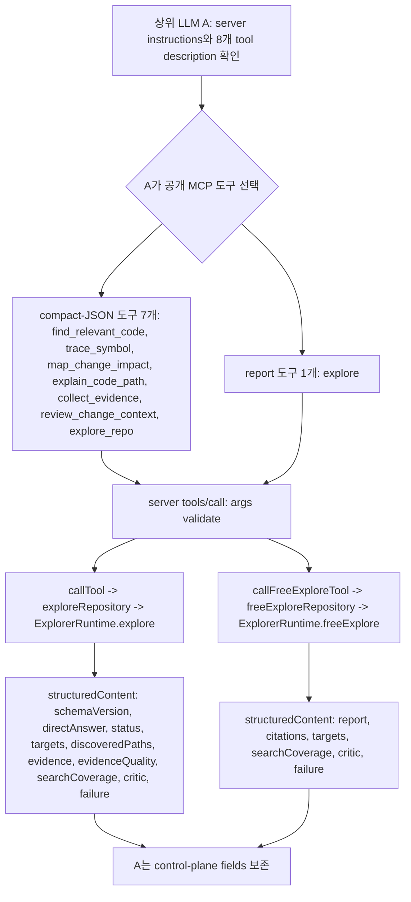
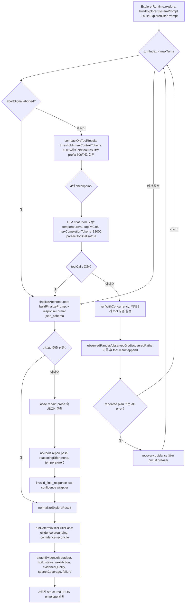
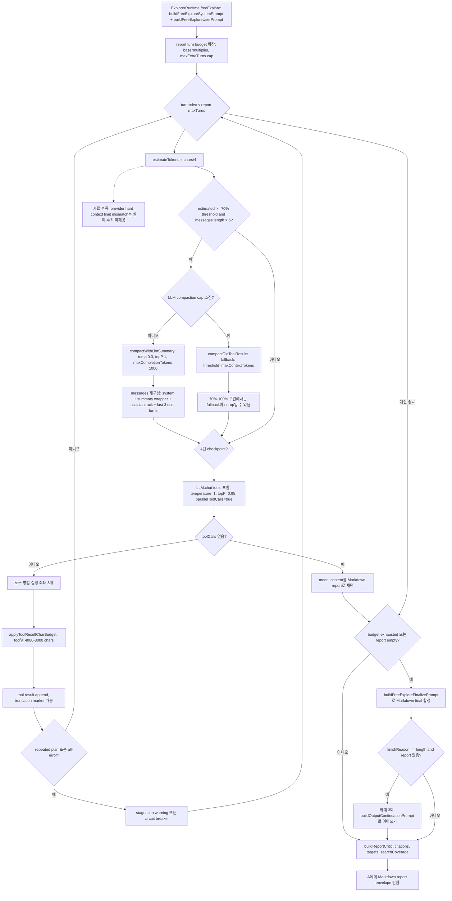

분석 기준은 업로드된 붙여넣은 텍스트이며, 새 ZIP `cerebras-explorer-mcp-master(8).zip`을 압축 해제해 `src/mcp/server.mjs`, `src/explorer/prompt.mjs`, `src/explorer/runtime.mjs`, `src/explorer/config.mjs`, `src/explorer/critic.mjs`, `src/explorer/schemas.mjs`, `src/explorer/cerebras-client.mjs`를 직접 대조했습니다. 
아래 코드 줄번호는 새 ZIP 압축 해제본 기준입니다.

## 수행 계획

1. 붙여넣은 텍스트의 §2 프롬프트와 §3 런타임 사실을 기준축으로 삼는다.
2. 새 ZIP 코드에서 해당 프롬프트·도구 description·런타임 분기를 직접 대조한다.
3. A 상위 LLM과 B Cerebras 탐색 LLM을 분리하고, compact-JSON 7개 도구와 report 1개 도구를 일관되게 구분한다.
4. §2의 모든 프롬프트와 §2.3.3 런타임 주입 메시지를 인벤토리화한다.
5. 프롬프트별 목적·산출물·지시문 정합성과 위험도를 평가한다.
6. Mermaid 그래프로 도구 분기, compact 루프, report 루프를 나눠 그린다.
7. 컨텍스트 초과 대비 안전성을 핵심 쟁점으로 다각 검토하고, 다관점 피드백을 교차검증해 우선순위 권고로 압축한다.

## 새 ZIP 직접 검증 요약

이 ZIP은 붙여넣은 HEAD 설명과 핵심 부분이 일치합니다. 서버 instructions에는 “single known symbol or claim”까지 도구 선호를 넓히는 문구가 실제로 들어 있고, 8개 도구 수는 `buildToolList()` 길이로 계산됩니다. [근거: §2.1.1; `src/mcp/server.mjs:222-232`, `src/mcp/server.mjs:745-757`] compact-JSON system prompt와 report system prompt 양쪽 모두 `UNTRUSTED CONTENT` HARD REQUIREMENT #5를 실제 포함합니다. [근거: §2.2.1, §2.2.4; `src/explorer/prompt.mjs:119-125`, `src/explorer/prompt.mjs:362-368`] report 경로는 `freeExplore()`에서 `buildFreeExploreSystemPrompt()`를 직접 사용하며, 별도 V2 프롬프트 경로는 이 ZIP 기준 확인되지 않습니다. [근거: §2.2.4; `src/explorer/runtime.mjs:1831-1881`, `src/explorer/runtime.mjs:2374-2377`]

---

# 단계 1 — 프롬프트 인벤토리 표

| 프롬프트 이름                                     | 대상 LLM | 경로                             | 트리거 시점                                           | 목적                                                                | 기대 산출물                       | 핵심 제약                                                                                                                                                                                                 |
| ------------------------------------------- | -----: | ------------------------------ | ------------------------------------------------ | ----------------------------------------------------------------- | ---------------------------- | ----------------------------------------------------------------------------------------------------------------------------------------------------------------------------------------------------- |
| 서버 `instructions` 문자열                       |   A 상위 | 공통                             | MCP `initialize` 응답                              | A에게 도구 우선 사용, 7+1 도구 구분, control-plane 보존 의무를 알림                  | A의 도구 선택·후속 요약 정책            | grep-then-read 루프면 단일 symbol/claim도 도구 선호, `status.verification`, `status.complete`, `evidenceQuality`, `searchCoverage`, `failure`, `critic.warnings` 보존. [근거: §2.1.1; `src/mcp/server.mjs:750-757`] |
| `explore_repo` description                  |   A 상위 | compact-JSON                   | A가 일반 구조화 탐색 fallback을 고를 때                      | 목적별 도구가 맞지 않는 read-only repo 탐색                                   | structured JSON              | edit/test/build/single known-file inspection 금지, 이후 broad grep/read 회피. [근거: §2.1.2; `src/mcp/server.mjs:35-47`]                                                                                      |
| `find_relevant_code` description            |   A 상위 | compact-JSON                   | 파일·라인 범위를 찾기 전                                   | feature/bug/config/route/behavior 관련 read/edit target 탐색          | targets + evidence           | exact file/range known, single grep sufficient, sibling tool 적합 시 금지. [근거: §2.1.2; `src/mcp/server.mjs:53-75`]                                                                                        |
| `trace_symbol` description                  |   A 상위 | compact-JSON                   | known symbol 정의·사용처 추적                           | definition + usage/callsite context                               | grounded targets/evidence    | symbol unknown이면 `find_relevant_code`, runtime flow면 `explain_code_path`. [근거: §2.1.2; `src/mcp/server.mjs:78-99`]                                                                                    |
| `map_change_impact` description             |   A 상위 | compact-JSON                   | 편집 전 blast radius 확인                             | edit/read/test/config/risky paths 식별                              | impact targets/evidence      | one-line known-file edit 금지, docs/examples는 best-effort. [근거: §2.1.2; `src/mcp/server.mjs:102-122`]                                                                                                   |
| `explain_code_path` description             |   A 상위 | compact-JSON                   | route/middleware/request/event/job/CLI flow 분석   | verified path와 next read targets                                  | path targets/evidence        | single symbol은 `trace_symbol`, static blast-radius는 `map_change_impact`. [근거: §2.1.2; `src/mcp/server.mjs:125-146`]                                                                                   |
| `collect_evidence` description              |   A 상위 | compact-JSON                   | 이미 있는 claim/hypothesis 검증                        | compact evidence bundle                                           | grounded file:line snippets  | whole PR/diff scoping은 `review_change_context`. [근거: §2.1.2; `src/mcp/server.mjs:149-169`]                                                                                                            |
| `review_change_context` description         |   A 상위 | compact-JSON                   | PR/review/recent-change 분석                       | 변경 사항·리스크·review attention target 요약                              | change context/evidence      | git-guided discovery + grounded code evidence. [근거: §2.1.2; `src/mcp/server.mjs:172-192`]                                                                                                             |
| `explore` description                       |   A 상위 | report                         | polished Markdown report가 필요할 때                  | architecture/onboarding/broad “how X works” 답변                    | Markdown report              | narrow lookup, symbol trace, impact, path, PR review는 purpose 도구 선호; structured edit planning은 `explore_repo`. [근거: §2.1.2; `src/mcp/server.mjs:197-217`]                                             |
| `buildExplorerSystemPrompt`                 |   B 탐색 | compact-JSON                   | compact 루프 시작 system message                     | read-only autonomous exploration, JSON 계약, evidence discipline 설정 | 최종 단일 JSON 객체                | READ-ONLY, JSON only, grounded evidence, no fabrication, untrusted content, tool order, evidence ledger, stop/error/efficiency rules. [근거: §2.2.1; `src/explorer/prompt.mjs:114-239`]                 |
| `buildExplorerUserPrompt`                   |   B 탐색 | compact-JSON                   | compact 루프 시작 user message                       | delegated task, scope, strategy, hints, prior targets 전달          | B의 초기 탐색 방향                  | `detectStrategy()` 또는 hints 기반, 필요 시 보완 전략 1회 전환, 충분하면 stop. [근거: §2.2.2; `src/explorer/prompt.mjs:56-70`, `src/explorer/prompt.mjs:254-307`]                                                         |
| `buildFinalizePrompt`                       |   B 탐색 | compact-JSON                   | no tool calls 또는 예산 소진 후 합성                      | JSON schema에 맞춘 최종 결과 강제                                          | 단일 JSON 객체                   | no tools, inspected evidence only, directAnswer ≤1200자, targets/evidence 각 8개. [근거: §2.2.3; `src/explorer/prompt.mjs:310-328`, `src/explorer/runtime.mjs:2287-2364`]                                  |
| `buildFreeExploreSystemPrompt`              |   B 탐색 | report                         | report 루프 시작 system message                      | Markdown investigation report 작성                                  | Markdown report              | read-only, Markdown only, every claim citation, no fabrication, untrusted content, phase strategy, context management. [근거: §2.2.4; `src/explorer/prompt.mjs:357-423`]                                |
| `buildFreeExploreUserPrompt`                |   B 탐색 | report                         | report 루프 시작 user message                        | report 대상 prompt/scope/context 전달                                 | report 탐색 지시                 | scope focus, runtime profile, enough evidence면 stop. [근거: §2.2.5; `src/explorer/prompt.mjs:336-349`]                                                                                                  |
| `buildFreeExploreFinalizePrompt`            |   B 탐색 | report                         | budget exhausted 또는 report empty 후               | Markdown final report 강제 합성                                       | Markdown report              | gathered info only, Summary→Findings→Key Code Paths→Uncertainty→Suggestions, no tools. [근거: §2.2.6; `src/explorer/prompt.mjs:450-458`, `src/explorer/runtime.mjs:2163-2179`]                          |
| `buildCompactionSummaryPrompt`              |   B 탐색 | report 전용                      | estimated tokens ≥ 70%이고 LLM compaction 가능할 때    | 이전 탐색을 citation 포함 요약                                             | 500 words 이하 summary         | key files/ranges, discoveries, unanswered questions, no tools. [근거: §2.3.1; `src/explorer/prompt.mjs:429-437`, `src/explorer/runtime.mjs:196-237`]                                                    |
| `buildOutputContinuationPrompt`             |   B 탐색 | report 전용                      | finalize output이 `length`로 잘렸을 때                 | 잘린 report 이어쓰기                                                    | continuation text            | 정확히 중단 지점부터, 반복 금지, no tools. [근거: §2.3.2; `src/explorer/prompt.mjs:443-445`, `src/explorer/runtime.mjs:2194-2250`]                                                                                   |
| compact checkpoint message                  |   B 탐색 | compact-JSON                   | 4턴마다, `maxTurns > 6`                             | 충분한 evidence면 finalize, 아니면 최소 next step                          | final 또는 1–2 tool calls      | “smallest next step” 제한. [근거: §2.3.3; `src/explorer/runtime.mjs:1411-1437`]                                                                                                                           |
| report checkpoint message                   |   B 탐색 | report                         | 4턴마다, `maxTurns > 6`                             | 충분한 evidence면 report 작성                                           | report 또는 next tool step     | most impactful next step. [근거: §2.3.3; `src/explorer/runtime.mjs:1927-1983`]                                                                                                                          |
| compact stagnation guidance                 |   B 탐색 | compact-JSON                   | repeated plan ≥2 또는 반복 all-error 직전              | 반복/무효 tool call 탈출                                                | finalize 또는 다른 tool/path     | 현재 findings로 finalize하거나 다른 tool/path 선택. [근거: §3.1; `src/explorer/runtime.mjs:1688-1700`]                                                                                                            |
| report stagnation warning                   |   B 탐색 | report                         | repeated plan ≥2 또는 반복 all-error 직전              | 반복/무효 tool call 탈출                                                | report 또는 다른 search approach | write report now 또는 completely different search approach. [근거: §2.3.3; `src/explorer/runtime.mjs:2133-2142`]                                                                                          |
| compaction recovered user wrapper           |   B 탐색 | report 전용                      | LLM summary 압축 후 messages 재구성                    | 요약 기반 계속 탐색                                                       | user context message         | 이미 covered files 재읽기 금지, 다른 line range 필요 시만 허용. [근거: §2.3.3; `src/explorer/runtime.mjs:219-234`]                                                                                                     |
| compaction assistant ack                    |   B 탐색 | report 전용                      | LLM summary 압축 직후                                | 대화 연속성 유지                                                         | assistant ack                | previous findings 기반 계속 탐색. [근거: §2.3.3; `src/explorer/runtime.mjs:229-232`]                                                                                                                          |
| simple truncation marker                    |   B 탐색 | compact-JSON 및 report fallback | `compactOldToolResults()`가 old tool result를 자를 때 | 절단 사실 표시                                                          | truncated tool content       | last 8 messages 보존, old tool result >400 chars이면 prefix 300 + marker. [근거: §2.3.3; `src/explorer/runtime.mjs:77-99`]                                                                                  |
| pre-synthesis tool-budget truncation marker |   B 탐색 | report 전용                      | report 경로 tool result char budget 초과 시           | 합성 전 절단 경고                                                        | truncated tool result        | tool별 4000–8000 chars budget, narrower query/read 권고. [근거: §2.3.3; `src/explorer/runtime.mjs:137-167`, `src/explorer/runtime.mjs:2100-2117`]                                                          |

---

# 단계 2 — 프롬프트별 정합성 검토

| 항목                               | 정합성 판단                                                                                                                                                                                     | 발견·위험                                                                                                                                                                                                                                                                                                                        | 심각도   |
| -------------------------------- | ------------------------------------------------------------------------------------------------------------------------------------------------------------------------------------------ | ---------------------------------------------------------------------------------------------------------------------------------------------------------------------------------------------------------------------------------------------------------------------------------------------------------------------------- | ----- |
| 서버 `instructions`                | A에게 “grep-then-read loop 대신 8개 도구 선호”와 control-plane 필드 보존을 직접 요구하므로 제품 목적인 A 컨텍스트 절감과 정렬된다. [근거: §2.1.1; `src/mcp/server.mjs:750-757`]                                                    | “single known symbol or claim”까지 도구 선호를 넓히는 문구는 `find_relevant_code`의 “single grep would suffice” 금지와 경계가 약간 충돌한다. 단순 grep 1회면 도구 남용이 될 수 있고, single claim 검증이면 `collect_evidence`가 맞다. [근거: §2.1.1, §2.1.2; `src/mcp/server.mjs:56-60`, `src/mcp/server.mjs:152-154`, `src/mcp/server.mjs:750-757`]                         | 중간    |
| `explore_repo` description       | structured JSON, multi-file, fallback, post-tool broad grep/read 회피가 목적과 맞다. [근거: §2.1.2; `src/mcp/server.mjs:35-45`]                                                                      | “general fallback”이 강하지만 specialized tools 선호 문구가 있어 라우팅 혼동은 제한된다. [근거: §2.1.2; `src/mcp/server.mjs:39-42`]                                                                                                                                                                                                                  | 낮음    |
| `find_relevant_code`             | locate-before-read/edit 목적과 targets/evidence 산출물이 잘 맞다. [근거: §2.1.2; `src/mcp/server.mjs:53-60`]                                                                                           | “single grep would suffice” 예외는 비용 절감에 좋지만, 서버 instructions의 단일 claim/symbol 도구 선호와 함께 읽으면 A가 어느 문구를 우선할지 모호할 수 있다. [근거: §2.1.1, §2.1.2; `src/mcp/server.mjs:56-60`, `src/mcp/server.mjs:750-757`]                                                                                                                           | 중간    |
| `trace_symbol`                   | known symbol에 대해 definition + usage/callsite를 한 번에 묶는 목적이 `repo_symbol_context` 권장과 정렬된다. [근거: §2.1.2, §2.2.1; `src/mcp/server.mjs:78-84`, `src/explorer/prompt.mjs:146-153`]              | symbol name만 정확하고 context가 거의 필요 없는 lookup에도 A가 호출할 가능성은 있지만, manual grep-then-read loop를 줄인다는 제품 철학과는 일치한다. [근거: §2.1.1, §2.1.2; `src/mcp/server.mjs:82-84`, `src/mcp/server.mjs:750-757`]                                                                                                                                  | 낮음~중간 |
| `map_change_impact`              | 편집 전 blast radius를 read-only로 식별하는 목적과 B prompt의 `role:edit` 허용이 일치한다. [근거: §2.1.2, §2.2.1; `src/mcp/server.mjs:102-108`, `src/explorer/prompt.mjs:121-132`]                               | “before editing” 도구인데 B는 READ-ONLY라서 혼동 가능성이 있지만, prompt가 “identifying a file to edit is not editing it”이라고 명시해 모순을 해소한다. [근거: §2.2.1; `src/explorer/prompt.mjs:121-125`]                                                                                                                                                    | 낮음    |
| `explain_code_path`              | runtime flow tracing 목적과 “verified path” 산출물 선언이 맞다. [근거: §2.1.2; `src/mcp/server.mjs:125-131`]                                                                                            | “verified path” 표현은 강하므로 A가 `status.verification`, `evidenceQuality`, `critic.warnings`를 같이 보존해야 한다. 이 보존 의무는 instructions에 있다. [근거: §2.1.1, §3.4; `src/mcp/server.mjs:750-757`, `src/mcp/server.mjs:615-634`]                                                                                                               | 낮음    |
| `collect_evidence`               | claim/hypothesis 검증 목적과 compact evidence bundle이 정확히 맞다. [근거: §2.1.2; `src/mcp/server.mjs:149-154`]                                                                                        | whole PR/diff scoping은 `review_change_context`로 보내라고 경계를 둬 혼동을 낮춘다. [근거: §2.1.2; `src/mcp/server.mjs:152-154`]                                                                                                                                                                                                               | 낮음    |
| `review_change_context`          | PR/recent-change 분석에 git-guided discovery를 붙이는 목적이 task builder의 `strategy: git-guided`와 맞다. [근거: §2.1.2; `src/mcp/server.mjs:172-177`, `src/mcp/server.mjs:364-379`]                      | 단일 review point는 `collect_evidence`와 일부 겹치나, `collect_evidence` description이 whole-PR/diff는 review tool로 보내라고 분리한다. [근거: §2.1.2; `src/mcp/server.mjs:152-154`, `src/mcp/server.mjs:175-177`]                                                                                                                                 | 낮음    |
| `explore`                        | human-facing Markdown report 목적과 description이 명확하다. [근거: §2.1.2; `src/mcp/server.mjs:197-204`]                                                                                             | Markdown report는 structured edit planning/programmatic next steps에 부적합하므로 description이 `explore_repo`를 명시적으로 지시한다. 이 경계는 적절하다. [근거: §2.1.2; `src/mcp/server.mjs:201-204`]                                                                                                                                                    | 낮음    |
| `buildExplorerSystemPrompt`      | READ-ONLY, JSON-only, grounded evidence, untrusted content, evidence ledger, stop conditions가 compact-JSON 목적과 강하게 정렬된다. [근거: §2.2.1; `src/explorer/prompt.mjs:114-239`]                   | Git evidence는 valid evidence로 허용하면서도 line range 없는 항목은 discard된다고 명시한다. 런타임 critic도 malformed/ungrounded evidence를 drop하므로 지시와 후처리가 맞물린다. [근거: §2.2.1, §3.3; `src/explorer/prompt.mjs:163-170`, `src/explorer/critic.mjs:173-214`, `src/explorer/runtime.mjs:1745-1764`]                                                     | 낮음    |
| `buildExplorerUserPrompt`        | task/scope/strategy/hints/prior targets를 한 prompt에 모아 B의 첫 행동을 좁힌다. [근거: §2.2.2; `src/explorer/prompt.mjs:254-307`]                                                                        | `detectStrategy()`는 regex weighted heuristic이며 복합 전략은 상위 2개를 반환할 수 있다. 오분류 시 “switch once” 제약이 탐색 회복을 제한할 수 있다. [근거: §2.2.2; `src/explorer/prompt.mjs:12-70`, `src/explorer/prompt.mjs:288-303`]                                                                                                                             | 중간    |
| `buildFinalizePrompt`            | final JSON, no tools, inspected evidence only, size limits가 `responseFormat: json_schema`와 결합되어 강하다. [근거: §2.2.3; `src/explorer/prompt.mjs:310-328`, `src/explorer/runtime.mjs:2287-2304`] | target/evidence 각 8개 제한은 broad architecture/impact 작업에서 근거 일부를 탈락시킬 수 있으나, compact path가 full report가 아니라 direct structured answer라는 점에서는 타당한 trade-off다. [근거: §2.2.3; `src/explorer/prompt.mjs:324-327`]                                                                                                                    | 낮음~중간 |
| `buildFreeExploreSystemPrompt`   | Markdown report 구조, every claim citation, phase strategy, untrusted content가 report 목적과 정렬된다. [근거: §2.2.4; `src/explorer/prompt.mjs:357-423`]                                              | “`[summarized]` or `[truncated]` markers → key information is preserved” 문구는 실제 truncation marker의 “missing evidence면 narrower query/read” 권고와 긴장된다. 단순 절단은 prefix만 보존하므로 핵심 정보 보존을 단정하면 안 된다. [근거: §2.2.4, §2.3.3; `src/explorer/prompt.mjs:384-388`, `src/explorer/runtime.mjs:77-99`, `src/explorer/runtime.mjs:163-167`] | 높음    |
| `buildFreeExploreUserPrompt`     | prompt/scope/context/runtime profile만 전달하는 간결한 구조라 report task에는 적절하다. [근거: §2.2.5; `src/explorer/prompt.mjs:336-349`]                                                                     | compact user prompt와 달리 explicit strategy는 주입하지 않는다. report 경로는 system prompt의 phase-based strategy에 의존하므로 broad report에는 적합하지만 narrow report에는 추가 회전이 생길 수 있다. [근거: §2.2.4, §2.2.5; `src/explorer/prompt.mjs:377-382`, `src/explorer/prompt.mjs:336-349`]                                                                   | 낮음~중간 |
| `buildFreeExploreFinalizePrompt` | budget exhausted/report empty 상황에서 gathered info only, fixed sections, no tools를 요구해 적절하다. [근거: §2.2.6; `src/explorer/prompt.mjs:450-458`, `src/explorer/runtime.mjs:2150-2179`]           | Markdown final은 JSON schema 강제가 없고, `finishReason === length` 복구도 finalize 단계에서만 동작한다. main loop에서 모델이 직접 report를 쓴 경우에는 cut-off recovery를 “trust natural stop”으로 둔다. [근거: §3.2; `src/explorer/runtime.mjs:2194-2257`]                                                                                                       | 중간    |
| `buildCompactionSummaryPrompt`   | report 장문 탐색에서 key files/line ranges/discoveries/unanswered questions를 압축하므로 목적에 맞다. [근거: §2.3.1; `src/explorer/prompt.mjs:429-437`, `src/explorer/runtime.mjs:196-237`]                   | LLM summary 자체는 temp=0.3, maxCompletionTokens=1000의 생성물이고, system + summary + recent 3 user turns만 남기므로 citation 유실·압축 손실 가능성이 구조적이다. [근거: §3.2; `src/explorer/runtime.mjs:196-237`, `src/explorer/runtime.mjs:106-129`]                                                                                                     | 중간    |
| `buildOutputContinuationPrompt`  | length cut-off recovery 목적과 “continue exactly, no repeat, no tools” 지시가 맞다. [근거: §2.3.2; `src/explorer/prompt.mjs:443-445`, `src/explorer/runtime.mjs:2194-2250`]                          | 이어붙임은 모델 지시 기반이며 deterministic overlap detection은 확인되지 않는다. `output_recovery` warning은 있으나 중복·불일치 자체를 자동 수정하지는 않는다. [근거: §3.2; `src/explorer/critic.mjs:602-608`, `src/explorer/runtime.mjs:2240-2248`]                                                                                                                      | 중간    |
| report critic                    | report 결과에 citations, targets, critic, searchCoverage를 붙이는 구조는 A handoff에 유용하다. [근거: §3.2; `src/explorer/runtime.mjs:2263-2284`, `src/mcp/server.mjs:637-653`]                             | 직접 코드 검증상 report critic은 citation path가 `filesRead`에 있었는지 중심으로 보고, cited line range가 실제 읽힌 범위였는지까지 compact 경로처럼 `observedRanges`로 검증하지 않는다. report path는 `filesRead` Set에 path만 기록한다. [근거: §3.2, §3.3; `src/explorer/runtime.mjs:1918-1920`, `src/explorer/runtime.mjs:2094-2096`, `src/explorer/critic.mjs:528-620`]        | 높음    |

---

# 단계 3 — 전체 로직 Mermaid 그래프

## 3.1 도구 디스패치 + 경로 분기

[근거: §1.2, §2.1.1, §2.1.2, §3.4; `src/mcp/server.mjs:222-232`, `src/mcp/server.mjs:615-653`, `src/mcp/server.mjs:656-719`, `src/mcp/server.mjs:778-808`]

## 3.2 compact-JSON 루프 + JSON finalize + deterministic critic

[근거: §3.1, §3.3; `src/explorer/runtime.mjs:1326-1811`, `src/explorer/runtime.mjs:77-99`, `src/explorer/runtime.mjs:1411-1437`, `src/explorer/runtime.mjs:1451-1462`, `src/explorer/runtime.mjs:1538-1664`, `src/explorer/runtime.mjs:1688-1700`, `src/explorer/runtime.mjs:2287-2364`, `src/explorer/critic.mjs:173-214`, `src/explorer/critic.mjs:436-482`]

## 3.3 report 루프 + 70% 요약 + 절단 폴백 + 출력 복구

[근거: §3.2; `src/explorer/runtime.mjs:1831-2284`, `src/explorer/runtime.mjs:57-66`, `src/explorer/runtime.mjs:106-129`, `src/explorer/runtime.mjs:137-167`, `src/explorer/runtime.mjs:1931-1974`, `src/explorer/runtime.mjs:2194-2250`, `src/explorer/critic.mjs:528-620`]

---

# 단계 4 — 그래프 기반 다각 분석

## 4(a) 도구 적합성

1. **7개 compact-JSON 도구는 같은 엔진을 공유하면서 A-facing description과 task builder로 intent를 분리한다.** 실제 dispatch에서 `find_relevant_code`부터 `review_change_context`까지는 각각 taskMode/hints를 만든 뒤 `callTool()`로 들어가며, `explore_repo`도 같은 `exploreRepository()` 경로를 탄다. [근거: §2.1.2; `src/mcp/server.mjs:289-379`, `src/mcp/server.mjs:778-804`, `src/mcp/server.mjs:656-675`]

2. **도구 간 경계는 대체로 명확하지만, “single known symbol or claim” 도구 선호는 over-triggering 위험을 만든다.** `find_relevant_code`는 single grep sufficient면 쓰지 말라고 하고, `trace_symbol`은 known symbol, `collect_evidence`는 known claim에 적합하다고 분리한다. 따라서 단순 검색은 피하고, grep-then-read loop가 필요할 때만 도구 호출하도록 A instructions 문구를 더 세분화하는 편이 안전하다. [근거: §2.1.1, §2.1.2; `src/mcp/server.mjs:56-60`, `src/mcp/server.mjs:78-84`, `src/mcp/server.mjs:149-154`, `src/mcp/server.mjs:750-757`]

3. **`explore`는 human report 전용 경계가 잘 잡혀 있다.** description은 polished prose가 목적일 때만 쓰고, narrow lookup·symbol trace·impact·path·review는 purpose tool, structured edit planning은 `explore_repo`로 보내라고 한다. [근거: §2.1.2; `src/mcp/server.mjs:197-204`]

4. **report 경로의 evidence 보장은 compact 경로보다 약하다.** compact 경로는 observed line ranges를 모아 deterministic critic으로 evidence를 exact/partial/drop 처리한다. report 경로는 `filesRead`가 path만 저장되고, `buildReportCritic()`은 citation path가 read file set에 있는지 중심으로 본다. 따라서 report의 `file:Lx-Ly` citation은 “그 파일을 읽었다” 수준의 후처리 검증이지, compact evidence처럼 “그 line range를 실제 읽었다” 수준의 검증이라고 보기 어렵다. [근거: §3.2, §3.3; `src/explorer/runtime.mjs:1587-1629`, `src/explorer/critic.mjs:28-67`, `src/explorer/critic.mjs:173-214`, `src/explorer/runtime.mjs:1918-1920`, `src/explorer/runtime.mjs:2094-2096`, `src/explorer/critic.mjs:528-620`]

## 4(b) 상위 LLM(A) 관점

1. **A는 도구 선택과 결과 보존 정책을 명확히 받는다.** instructions는 `explore_repo`와 `explore`의 산출 차이를 설명하고, purpose shortcut 6개를 나열하며, control-plane fields를 verbatim 보존하라고 한다. [근거: §2.1.1; `src/mcp/server.mjs:750-757`]

2. **A의 컨텍스트 절감 목적은 반환 envelope와 잘 맞는다.** compact 결과에는 `directAnswer`, `targets`, `discoveredPaths`, `evidence`, `evidenceQuality`, `searchCoverage`, `critic`, `failure`가 포함되고, 이는 A가 broad grep/read를 반복하지 않고 cited target 중심으로 후속 작업을 하게 한다. [근거: §3.4; `src/explorer/schemas.mjs:292-323`, `src/mcp/server.mjs:615-634`]

3. **A 관점의 주 위험은 경고 필드 손실이다.** runtime은 `critic.warnings`, `evidenceQuality`, `searchCoverage`, `failure`를 별도 부가하지만, A가 최종 사용자에게 요약하면서 이를 생략하면 “컨텍스트 절감”이 “근거 품질 신호 손실”로 바뀐다. instructions가 보존을 요구하는 이유가 여기에 있다. [근거: §2.1.1, §3.4; `src/mcp/server.mjs:615-653`, `src/mcp/server.mjs:750-757`]

4. **report 결과는 A에게 사람이 읽기 좋은 답변을 주지만, 기계적 후속 편집에는 compact 결과보다 불리하다.** report envelope는 `report`, `citations`, `targets`, `searchCoverage`, `critic`, `failure`를 제공하지만, compact의 `evidence[]`처럼 snippet/id/groundingStatus가 붙은 증거 목록은 아니다. [근거: §3.4; `src/mcp/server.mjs:637-653`, `src/explorer/runtime.mjs:2263-2284`, `src/explorer/schemas.mjs:264-323`]

## 4(c) Cerebras 탐색 LLM(B) 관점

1. **compact-JSON system prompt는 B의 자율 루프 행동을 충분히 제약한다.** tool order, evidence ledger, stop conditions, efficiency rules, error recovery가 모두 “작게 읽고, 근거를 모으고, 충분하면 멈추는” 방향으로 정렬된다. [근거: §2.2.1; `src/explorer/prompt.mjs:146-203`]

2. **`UNTRUSTED CONTENT` #5는 양 경로에 모두 있어 prompt injection 방어의 기본선이 있다.** repo contents, docs, tests, diffs, commit messages를 지시가 아닌 untrusted data로 보라고 명시하므로, B가 repository 안의 악성 instructions를 따르지 않아야 한다. [근거: §2.2.1, §2.2.4; `src/explorer/prompt.mjs:119-125`, `src/explorer/prompt.mjs:362-368`]

3. **compact JSON 계약은 지시문과 런타임 모두에서 강하다.** final prompt는 JSON only/no tools/inspected evidence only를 요구하고, runtime은 json_schema, normal parse, loose repair, no-tools repair, invalid fallback을 둔다. [근거: §2.2.3, §3.1; `src/explorer/prompt.mjs:310-328`, `src/explorer/runtime.mjs:2287-2364`]

4. **report 경로는 B가 자유롭게 합성하기 쉬운 대신, 후처리 검증이 약하다.** every claim citation 지시는 강하지만, 실제 report critic은 path-level read 여부와 citation 존재 중심이며, compact처럼 observedRanges 기반 line-range grounding pass를 사용하지 않는다. [근거: §2.2.4, §3.2; `src/explorer/prompt.mjs:362-398`, `src/explorer/critic.mjs:528-620`]

---

# 단계 5 — 컨텍스트 윈도우 초과 대비 안전성 분석

## 5(a) 요약 기능 존재 여부

| 경로           | 있는 장치                                                                                                                 | 없는 장치                                                                  | 의미                                                                                                                                                                                                                                                                     |
| ------------ | --------------------------------------------------------------------------------------------------------------------- | ---------------------------------------------------------------------- | ---------------------------------------------------------------------------------------------------------------------------------------------------------------------------------------------------------------------------------------------------------------------- |
| compact-JSON | `compactOldToolResults()` 단순 절단, JSON schema finalization, 4단계 JSON 복구, deterministic critic, evidence snippet attach | 70% proactive LLM summary 없음, output continuation 없음                   | final JSON의 형식·evidence grounding은 강하지만, 컨텍스트가 커지는 과정 자체는 100% threshold 전까지 거의 방치된다. [근거: §3.1, §3.3; `src/explorer/runtime.mjs:77-99`, `src/explorer/runtime.mjs:1429-1430`, `src/explorer/runtime.mjs:2287-2364`, `src/explorer/critic.mjs:436-482`]                |
| report       | 70% LLM summary, summary cap, 단순 절단 fallback, tool-result char budget, output continuation 최대 3회                      | JSON schema final 없음, compact와 같은 observedRanges evidence grounding 없음 | 장문 report에는 적극적이지만, summary·continuation이 모두 LLM 생성이라 정보손실·중복 위험이 있고, report citation 검증은 compact보다 약하다. [근거: §3.2; `src/explorer/runtime.mjs:137-167`, `src/explorer/runtime.mjs:1931-1974`, `src/explorer/runtime.mjs:2194-2250`, `src/explorer/critic.mjs:528-620`] |

## 5(b) 안전성 가설 검토

| 가설                                                        | 평가                                                                                                                                                                                                                                                                                         | 근거                                                                                                                                                                                               |
| --------------------------------------------------------- | ------------------------------------------------------------------------------------------------------------------------------------------------------------------------------------------------------------------------------------------------------------------------------------------ | ------------------------------------------------------------------------------------------------------------------------------------------------------------------------------------------------ |
| 단순 절단 300자가 grounded evidence line range/snippet을 손상시킬 위험 | **부분 확증.** `compactOldToolResults()`는 last 8 messages 전의 tool result 중 400자 초과분을 앞 300자 + marker로 자르므로 B가 final synthesis에서 원문 snippet을 잃을 수 있다. 다만 compact 경로는 tool result append 전에 `observedRanges`를 별도 기록하고, critic이 evidence line range를 후검증하므로 ungrounded evidence가 그대로 남는 위험은 완화된다. | §3.1, §3.3; `src/explorer/runtime.mjs:77-99`, `src/explorer/runtime.mjs:1587-1629`, `src/explorer/critic.mjs:173-214`, `src/explorer/runtime.mjs:1745-1764`                                      |
| `estimateTokens = chars/4`가 한국어/비ASCII에서 임계 판단을 오도할 위험    | **확증.** estimate는 content/tool_calls/reasoning 길이를 문자수/4로 계산하고 tokenizer를 쓰지 않는다. 따라서 한국어·비ASCII·JSON overhead에서 과소/과대 추정 가능성이 있다. 공급자 hard context limit 수치는 자료에 없으므로 실제 실패 임계는 자료 부족이다.                                                                                                  | §3.2; `src/explorer/runtime.mjs:53-66`                                                                                                                                                           |
| compact-JSON 경로에 70% 사전 요약이 없고 100% 절단만 있는 점은 안전한가        | **반증에 가까움.** compact 경로는 매 턴 `compactOldToolResults(messages, maxContextTokens)`만 호출하며, 그 함수는 estimate가 threshold 미만이면 no-op이다. threshold가 deep 기준 110,000이라 실제 provider limit 또는 추정 오차가 더 낮으면 호출 실패 가능성이 남는다.                                                                             | §3.1; `src/explorer/runtime.mjs:77-80`, `src/explorer/runtime.mjs:1429-1430`, `src/explorer/config.mjs:154-165`                                                                                  |
| LLM 요약이 citation 유실·환각·정보손실을 일으킬 위험                       | **추정 확증.** summary prompt는 citations를 요구하지만, summary는 temp=0.3/topP=1/maxCompletionTokens=1000의 LLM 생성물이고, 재구성은 system + summary wrapper + assistant ack + last 3 user turns만 남긴다. 중간 tool result 원문은 버려지므로 citation loss와 압축 손실 가능성이 구조적이다.                                               | §2.3.1, §3.2; `src/explorer/runtime.mjs:196-237`, `src/explorer/runtime.mjs:106-129`                                                                                                             |
| `sliceRecentTurns(messages, 3)` 설계 trade-off              | **중립적 trade-off.** 최근 3개 user turn부터 끝까지 보존해 직전 맥락은 살리지만, 그 이전 중간 이력은 summary에 의존한다. 장기 탐색에서는 누락 위험이 있고, 반대로 context 폭증은 줄인다.                                                                                                                                                              | §3.2; `src/explorer/runtime.mjs:101-129`, `src/explorer/runtime.mjs:219-234`                                                                                                                     |
| cap 소진/요약 실패 시 단순 절단 fallback이 안전 종료를 보장하는가               | **반증.** report 경로는 70% 도달 시 cap 소진 또는 summary 실패면 `compactOldToolResults(messages, maxContextTokens)`를 호출한다. 그러나 `compactOldToolResults()`는 100% threshold 미만이면 no-op이므로 70%~100% 구간 fallback은 실제로 줄이지 않을 수 있다.                                                                            | §3.2; `src/explorer/runtime.mjs:77-80`, `src/explorer/runtime.mjs:1931-1974`                                                                                                                     |
| 출력 이어쓰기 최대 3회가 잘린 리포트를 안전 복원하는가                           | **부분 확증/부분 반증.** finalize 단계에서 `finishReason === length`면 최대 3회 continuation을 붙인다. 그러나 overlap detection이나 consistency check는 확인되지 않고, main loop에서 직접 report를 쓴 경우 recovery는 하지 않는다.                                                                                                       | §2.3.2, §3.2; `src/explorer/runtime.mjs:2194-2257`, `src/explorer/critic.mjs:602-608`                                                                                                            |
| report tool-result char budget marker가 안전한가               | **부분 확증.** report tool result는 tool별 4000–8000 chars budget으로 사전 절단되고, marker가 narrower query/read를 권고한다. 그러나 system prompt가 `[truncated]` marker의 key information preserved를 단정하므로 B가 missing evidence를 재조회하지 않을 수 있다.                                                                    | §2.2.4, §2.3.3; `src/explorer/prompt.mjs:384-388`, `src/explorer/runtime.mjs:137-167`, `src/explorer/runtime.mjs:2100-2117`                                                                      |
| report citation grounding이 compact와 동등한가                  | **반증.** compact는 observedRanges와 evidence line range를 비교한다. report는 `filesRead` Set에 path만 넣고, report critic은 citation path가 read file set에 없는지를 경고한다. line range가 실제 읽힌 범위인지 확인하는 동등한 pass는 코드에서 확인되지 않는다.                                                                                | §3.2, §3.3; `src/explorer/runtime.mjs:1587-1629`, `src/explorer/critic.mjs:28-67`, `src/explorer/runtime.mjs:1918-1920`, `src/explorer/runtime.mjs:2094-2096`, `src/explorer/critic.mjs:563-572` |

## 5(c) 결론과 개선안

**결론:** 현재 설계는 일반 상황에서 A의 컨텍스트를 크게 절약하고, compact-JSON 경로에서는 evidence grounding을 상당히 강하게 보장한다. 그러나 “컨텍스트 초과 상황에서도 항상 grounded evidence가 보장된 결과를 안전하게 반환한다”고 보기는 어렵다. 핵심 이유는 compact 경로의 proactive compaction 부재, report fallback no-op 가능성, LLM summary의 손실성, report citation grounding의 path-level 한계다. [근거: §3.1, §3.2, §3.3; `src/explorer/runtime.mjs:77-99`, `src/explorer/runtime.mjs:1931-1974`, `src/explorer/runtime.mjs:196-237`, `src/explorer/critic.mjs:528-620`]

우선 개선안은 다음과 같습니다.

1. **compact-JSON 경로에도 70% proactive compaction을 추가하되, LLM summary만이 아니라 deterministic evidence ledger를 함께 주입한다.** observedRanges/observedGit는 이미 기록되므로, final synthesis 전에 verified path:line ledger와 짧은 snippet을 재주입하면 tool result 절단 손실을 줄일 수 있다. [근거: §3.1, §3.3; `src/explorer/runtime.mjs:1407-1409`, `src/explorer/runtime.mjs:1587-1629`, `src/explorer/runtime.mjs:1745-1764`]

2. **report fallback threshold를 100%가 아니라 70% 이하로 실제 감소하도록 바꾼다.** cap 소진/요약 실패 시 `compactOldToolResults(messages, maxContextTokens)`가 no-op이 될 수 있으므로, fallback 함수에 target threshold를 별도 전달해야 한다. [근거: §3.2; `src/explorer/runtime.mjs:77-80`, `src/explorer/runtime.mjs:1931-1974`]

3. **report path에도 line-range observed ledger를 기록하고 `buildReportCritic()`이 citation line range를 검증하게 한다.** 지금은 path-level read 여부 중심이므로 Markdown report의 `file:Lx-Ly` 신뢰도가 compact evidence보다 낮다. [근거: §3.2, §3.3; `src/explorer/runtime.mjs:1918-1920`, `src/explorer/runtime.mjs:2094-2096`, `src/explorer/critic.mjs:528-620`]

4. **`estimateTokens(chars/4)`에 model/provider-aware tokenizer 또는 보수적 safety margin을 적용한다.** 특히 한국어/비ASCII와 tool_calls JSON/reasoning 길이를 고려해야 provider hard limit 전 축소가 가능하다. [근거: §3.2; `src/explorer/runtime.mjs:53-66`, `src/explorer/cerebras-client.mjs:138-167`]

5. **report prompt의 `[truncated]` 해석 문구를 약화한다.** “key information is preserved” 대신 “content may be omitted; re-read narrower ranges if evidence is missing”으로 바꾸면 actual truncation marker와 정합성이 올라간다. [근거: §2.2.4, §2.3.3; `src/explorer/prompt.mjs:384-388`, `src/explorer/runtime.mjs:163-167`]

---

# 단계 6 — 다관점 피드백 생성 → 교차검증 → 최종 정리

## 6.1 대상 선정과 피드백 생성

| 대상                                   | 적대적 피드백                                                                                                                                                                                                              | 우호적 피드백                                                                                                                                                                                                               | 중립적 피드백                                                                                                                                                                                                              |
| ------------------------------------ | -------------------------------------------------------------------------------------------------------------------------------------------------------------------------------------------------------------------- | --------------------------------------------------------------------------------------------------------------------------------------------------------------------------------------------------------------------- | -------------------------------------------------------------------------------------------------------------------------------------------------------------------------------------------------------------------- |
| F1. compact 경로의 100% 단순 절단           | **프로젝트 사용자 관점:** 컨텍스트가 커진 뒤에야 prefix 300자 절단을 하므로, B가 final synthesis에 필요한 tool result 본문을 잃을 수 있다. [근거: §3.1; `src/explorer/runtime.mjs:77-99`, `src/explorer/runtime.mjs:1429-1430`]                               | **B 관점:** observedRanges와 deterministic critic이 별도 존재하므로, ungrounded evidence가 최종 retained evidence로 남는 위험은 크게 줄어든다. [근거: §3.3; `src/explorer/runtime.mjs:1587-1629`, `src/explorer/critic.mjs:173-214`]              | **A 관점:** 절단은 컨텍스트 절감에는 맞지만, A가 `evidenceQuality/searchCoverage/critic.warnings`를 보존해야만 손실 신호를 해석할 수 있다. [근거: §2.1.1, §3.4; `src/mcp/server.mjs:750-757`, `src/mcp/server.mjs:615-634`]                              |
| F2. report 경로 LLM summary + fallback | **B 관점:** summary가 citation을 잃거나 잘못 압축하면 이후 탐색 전체가 요약문에 의존한다. [근거: §2.3.1, §3.2; `src/explorer/runtime.mjs:196-237`]                                                                                                 | **프로젝트 사용자 관점:** 장문 report에는 단순 절단보다 LLM summary가 유용하고, last 3 user turns 보존은 최근 맥락을 살린다. [근거: §3.2; `src/explorer/runtime.mjs:106-129`, `src/explorer/runtime.mjs:219-234`]                                          | **A 관점:** cap 소진/요약 실패 시 fallback이 70%~100% 구간에서 no-op일 수 있으므로, searchCoverage/critic 경고를 같이 봐야 한다. [근거: §3.2; `src/explorer/runtime.mjs:77-80`, `src/explorer/runtime.mjs:1931-1974`]                               |
| F3. report citation grounding 약함     | **A 관점:** Markdown report의 file:line citation을 compact evidence와 같은 수준으로 믿으면 위험하다. report critic은 path-level read 여부 중심이다. [근거: §3.2, §3.3; `src/explorer/runtime.mjs:1918-1920`, `src/explorer/critic.mjs:528-620`] | **프로젝트 사용자 관점:** report는 human consumption 목적이므로, citations/targets/critic/searchCoverage만 있어도 broad understanding에는 충분히 유용하다. [근거: §2.1.2, §3.2; `src/mcp/server.mjs:197-204`, `src/explorer/runtime.mjs:2263-2284`] | **B 관점:** report path는 polished prose를 만들기 위한 trade-off이고, structured edit planning은 description상 `explore_repo`로 보내도록 되어 있다. [근거: §2.1.2; `src/mcp/server.mjs:201-204`]                                             |
| F4. over-triggering 라우팅              | **A 관점:** single symbol/claim까지 도구를 선호하면 단순 grep보다 latency/cost가 커질 수 있다. [근거: §2.1.1; `src/mcp/server.mjs:750-757`]                                                                                                 | **프로젝트 사용자 관점:** 단일 claim이라도 grep-then-read loop가 필요하면 외부 B에게 맡기는 것이 A 컨텍스트 절감 목적과 맞다. [근거: §1.2, §2.1.1; `src/mcp/server.mjs:750-757`]                                                                               | **B 관점:** purpose tool 경계가 있으므로 `trace_symbol`, `collect_evidence`, `find_relevant_code`로 route가 나뉘면 과잉 탐색은 완화된다. [근거: §2.1.2; `src/mcp/server.mjs:53-60`, `src/mcp/server.mjs:78-84`, `src/mcp/server.mjs:149-154`] |
| F5. untrusted-content rule           | **프로젝트 사용자 관점:** #5가 있어도 prompt injection 방어는 모델 준수에 의존하며, runtime이 repo content instructions를 별도 필터링한다는 근거는 없다. [근거: §2.2.1, §2.2.4; `src/explorer/prompt.mjs:119-125`, `src/explorer/prompt.mjs:362-368`]          | **B 관점:** #5는 양 경로 system prompt에 들어 있어 repo contents/tool outputs를 instructions와 분리하는 핵심 안전장치다. [근거: §2.2.1, §2.2.4; `src/explorer/prompt.mjs:119-125`, `src/explorer/prompt.mjs:362-368`]                           | **A 관점:** A는 B의 raw repo context를 보지 않고 envelope를 받으므로, B가 #5를 지키고 critic이 근거 품질을 노출하면 위험은 일부 완화된다. [근거: §3.4; `src/mcp/server.mjs:615-653`]                                                                         |

## 6.2 교차검증 표

| 피드백    | 평가자 1 반박                                                                                                                                                                | 평가자 2 반박                                                                                                                                                | 판정                                                       |
| ------ | ----------------------------------------------------------------------------------------------------------------------------------------------------------------------- | ------------------------------------------------------------------------------------------------------------------------------------------------------- | -------------------------------------------------------- |
| F1 적대적 | **우호적·B:** observedRanges는 tool result 절단과 별개로 기록되며, critic이 ungrounded evidence를 drop한다. [근거: `src/explorer/runtime.mjs:1587-1629`, `src/explorer/critic.mjs:173-214`] | **중립적·A:** 손상 위험은 “허위 근거 통과”보다 “B 합성 정보 부족” 쪽에 가깝다. [근거: `src/explorer/runtime.mjs:1745-1764`]                                                          | **부분 생존:** 표현을 “근거 무결성 붕괴”보다 “합성 정보손실”로 조정.              |
| F1 우호적 | **적대적·사용자:** critic은 evidence item 검증기이지 directAnswer 모든 문장 검증기가 아니다. [근거: `src/explorer/critic.mjs:436-482`]                                                           | **중립적·A:** evidence가 모델 출력에 없으면 attach metadata가 새 evidence를 복구하지는 못한다. [근거: `src/explorer/runtime.mjs:658-670`]                                        | **부분 생존:** safety net은 강하지만 완전 보장은 아님.                   |
| F1 중립적 | **적대적·사용자:** A가 경고를 보존해도 이미 잘린 정보는 돌아오지 않는다. [근거: `src/explorer/runtime.mjs:77-99`]                                                                                     | **우호적·A:** control-plane 보존은 후속 좁은 재탐색을 결정하는 데 충분히 가치 있다. [근거: `src/mcp/server.mjs:750-757`]                                                            | **생존:** 보존은 필요조건이지 충분조건은 아님.                             |
| F2 적대적 | **우호적·사용자:** summary prompt는 key files/ranges와 unanswered questions를 요구하므로 무작정 절단보다는 낫다. [근거: `src/explorer/prompt.mjs:429-437`]                                        | **중립적·B:** recent 3 user turns 보존은 직전 탐색 맥락을 유지한다. [근거: `src/explorer/runtime.mjs:106-129`]                                                             | **생존:** summary는 필요하지만 손실성은 구조적.                         |
| F2 우호적 | **적대적·A:** summary가 틀리면 A는 더 적은 컨텍스트로 더 잘못된 report를 받는다. [근거: `src/explorer/runtime.mjs:196-237`]                                                                       | **중립적·사용자:** cap fallback no-op 가능성이 있어 “충분히 안전”하다고는 못 한다. [근거: `src/explorer/runtime.mjs:77-80`, `src/explorer/runtime.mjs:1952-1974`]                 | **부분 생존:** 방향은 좋지만 fallback 보강 필요.                       |
| F2 중립적 | **우호적·B:** 100% 이상에서는 fallback 절단이 동작한다. [근거: `src/explorer/runtime.mjs:77-99`]                                                                                         | **적대적·사용자:** provider hard limit이 추정치 100%보다 낮으면 그 전에 실패할 수 있다; 실제 수치는 자료 부족. [근거: §3.2; `src/explorer/runtime.mjs:53-66`]                              | **생존:** threshold gap은 실제 설계 리스크.                        |
| F3 적대적 | **우호적·사용자:** report는 human consumption 목적이고 compact와 같은 계약을 의도한 도구가 아니다. [근거: `src/mcp/server.mjs:197-204`]                                                             | **중립적·B:** report critic은 citation absence, unread path, budget/error/truncation을 경고하므로 완전히 무방비는 아니다. [근거: `src/explorer/critic.mjs:528-620`]           | **생존:** compact와 동등하지 않다는 점은 유지.                         |
| F3 우호적 | **적대적·A:** broad understanding에도 잘못된 line citation은 신뢰를 해칠 수 있다. [근거: `src/explorer/critic.mjs:563-572`]                                                                | **중립적·B:** path-level read check는 최소 기준이며 line-range ledger가 있으면 더 낫다. [근거: `src/explorer/runtime.mjs:1918-1920`, `src/explorer/runtime.mjs:2094-2096`] | **부분 생존:** 유용성은 인정, grounding 강화 필요.                     |
| F3 중립적 | **적대적·A:** A가 report를 edit planning에 잘못 쓰면 risk가 커진다. [근거: `src/mcp/server.mjs:201-204`]                                                                                | **우호적·사용자:** description이 misuse를 명시적으로 막는다. [근거: `src/mcp/server.mjs:201-204`]                                                                         | **생존:** route compliance가 관건.                            |
| F4 적대적 | **우호적·사용자:** 단일 claim도 evidence bundle을 받으면 A 컨텍스트 절감 효과가 크다. [근거: `src/mcp/server.mjs:149-154`, `src/mcp/server.mjs:750-757`]                                          | **중립적·B:** `single grep would suffice` 예외가 있어 단순 검색은 description상 배제된다. [근거: `src/mcp/server.mjs:56-60`]                                                | **부분 생존:** 비용 리스크는 있지만 의도된 철학도 있음.                       |
| F4 우호적 | **적대적·A:** latency/cost는 실제 UX 요소이며 자료에는 비용·지연 수치가 없다. [근거: 자료 부족(확인 필요)]                                                                                               | **중립적·사용자:** single symbol, single claim, single grep의 기준을 더 명확히 해야 한다. [근거: `src/mcp/server.mjs:56-60`, `src/mcp/server.mjs:750-757`]                  | **생존:** 원칙은 좋고 문구 개선 필요.                                 |
| F4 중립적 | **적대적·A:** A가 긴 description을 항상 정밀하게 따를 보장은 자료에 없다. [근거: 자료 부족(확인 필요)]                                                                                                  | **우호적·B:** task builders가 taskMode/hints를 넣어 내부 탐색을 목적별로 좁힌다. [근거: `src/mcp/server.mjs:289-379`]                                                        | **생존:** description 기반 routing은 충분하지만 완전하지 않음.           |
| F5 적대적 | **우호적·B:** #5가 system prompt의 HARD REQUIREMENTS 안에 있어 모델 준수 신호가 강하다. [근거: `src/explorer/prompt.mjs:119-125`, `src/explorer/prompt.mjs:362-368`]                         | **중립적·A:** runtime 필터링은 확인되지 않지만, A는 raw repo instructions가 아니라 post-processed envelope를 받는다. [근거: `src/mcp/server.mjs:615-653`]                        | **부분 생존:** prompt-level 방어는 강하나 runtime-level 보강은 자료 부족. |
| F5 우호적 | **적대적·사용자:** repo content injection은 모델의 instruction-following 취약점 영역이므로 prompt만으로 완전 방어는 아니다. [근거: §2.2.1, §2.2.4]                                                     | **중립적·A:** critic은 evidence grounding을 보지만 malicious instruction obey 여부 자체를 formal하게 검증하지 않는다. [근거: `src/explorer/critic.mjs:436-482`]                 | **부분 생존:** 핵심 장치지만 완전 방어 아님.                             |
| F5 중립적 | **우호적·B:** 양 경로에 #5가 들어간 점은 새 ZIP 기준 명확한 개선이다. [근거: `src/explorer/prompt.mjs:119-125`, `src/explorer/prompt.mjs:362-368`]                                               | **적대적·사용자:** A가 report만 보고 경고를 생략하면 injection 관련 이상 징후를 놓칠 수 있다. [근거: `src/mcp/server.mjs:750-757`, `src/mcp/server.mjs:637-653`]                       | **생존:** A의 field 보존까지 포함해야 안전성이 유지됨.                     |

## 6.3 교차검증 후 합의 사항

1. **compact-JSON 경로의 evidence grounding은 강하지만, context growth 관리 자체는 약하다.** 100% 단순 절단만으로는 provider hard limit/추정 오차/합성 정보손실을 충분히 흡수한다고 보기 어렵다. [근거: §3.1, §3.3; `src/explorer/runtime.mjs:77-99`, `src/explorer/runtime.mjs:1429-1430`, `src/explorer/critic.mjs:436-482`]

2. **report 경로의 LLM summary는 장문 탐색에 필요하지만 손실적이다.** summary prompt와 recent-turn 보존은 유용하나, cap fallback no-op 가능성과 citation loss 가능성이 남는다. [근거: §3.2; `src/explorer/runtime.mjs:196-237`, `src/explorer/runtime.mjs:106-129`, `src/explorer/runtime.mjs:1931-1974`]

3. **report citation grounding은 compact evidence grounding과 동등하지 않다.** 이 ZIP 기준 직접 검증 결과, report path는 filesRead path 중심이고 line-range observed ledger를 report critic에 넘기지 않는다. [근거: §3.2, §3.3; `src/explorer/runtime.mjs:1918-1920`, `src/explorer/runtime.mjs:2094-2096`, `src/explorer/critic.mjs:528-620`]

4. **A의 control-plane 필드 보존은 제품 신뢰성의 핵심이다.** `evidenceQuality`, `searchCoverage`, `failure`, `critic.warnings`가 사라지면 A는 낮은 신뢰도·예산 중단·절단 경고를 놓칠 수 있다. [근거: §2.1.1, §3.4; `src/mcp/server.mjs:750-757`, `src/mcp/server.mjs:615-653`]

5. **`UNTRUSTED CONTENT` #5는 새 ZIP 기준 양 경로에 실제 존재한다.** 이는 이전 ZIP 불일치 우려와 달리 이 ZIP에서는 HEAD 분석 텍스트와 코드가 일치한다. [근거: §2.2.1, §2.2.4; `src/explorer/prompt.mjs:119-125`, `src/explorer/prompt.mjs:362-368`]

## 6.4 합의되지 않은 잔여 이견

| 이견                                                   | 왜 갈리는가                                                                                                                                                                        | 현재 판단                                                                            |
| ---------------------------------------------------- | ----------------------------------------------------------------------------------------------------------------------------------------------------------------------------- | -------------------------------------------------------------------------------- |
| 단일 symbol/claim까지 도구 선호가 과잉인가                        | A 컨텍스트 절감을 최우선하면 정당화되고, latency/cost를 중시하면 과잉이다. [근거: §2.1.1, §2.1.2; `src/mcp/server.mjs:56-60`, `src/mcp/server.mjs:750-757`]                                               | over-trigger 위험은 **중간**. “single grep”과 “grep-then-read loop” 기준을 더 분명히 해야 한다.   |
| LLM summary가 단순 절단보다 항상 안전한가                         | 정보 압축에는 summary가 낫지만, hallucination/citation loss 가능성은 단순 절단보다 복잡하다. [근거: §2.3.1, §3.2; `src/explorer/runtime.mjs:196-237`]                                                   | report에는 필요하되 deterministic citation ledger와 결합해야 한다.                            |
| report tool을 broad architecture에만 쓰면 현재 critic이 충분한가 | human report에는 충분하다는 관점과, file:line citation 신뢰를 위해 line-range validation이 필요하다는 관점이 갈린다. [근거: §2.1.2, §3.2; `src/mcp/server.mjs:197-204`, `src/explorer/critic.mjs:528-620`] | human consumption에는 유용하지만 trust-critical handoff에는 sidecar/line-grounding 보강 권고. |

## 6.5 우선순위 실행 권고 Top 5

1. **report 경로에 observed line-range ledger를 추가하고 `buildReportCritic()`이 citation line range를 검증하게 한다.** 현재 report critic은 path-level read 여부 중심이어서 Markdown `file:Lx-Ly` citation의 신뢰성이 compact evidence보다 낮다. [근거: `src/explorer/runtime.mjs:1918-1920`, `src/explorer/runtime.mjs:2094-2096`, `src/explorer/critic.mjs:528-620`]

2. **compact-JSON 경로에 70% proactive compaction을 도입한다.** 단순 LLM summary만 넣지 말고 observedRanges/observedGit 기반 deterministic evidence ledger와 짧은 snippets를 함께 주입해야 한다. [근거: `src/explorer/runtime.mjs:77-99`, `src/explorer/runtime.mjs:1407-1409`, `src/explorer/runtime.mjs:1587-1629`]

3. **report fallback no-op을 수정한다.** cap 소진/요약 실패 시 100% threshold의 `compactOldToolResults()`를 부르는 대신, 실제 estimate가 70% 이하로 내려가도록 별도 target threshold 절단·요약 로직을 둔다. [근거: `src/explorer/runtime.mjs:77-80`, `src/explorer/runtime.mjs:1931-1974`]

4. **`estimateTokens(chars/4)`를 provider/model-aware로 보수화한다.** 최소한 non-ASCII/한국어 및 tool_calls JSON/reasoning 길이에 safety margin을 적용해 provider hard limit 전 compaction이 일어나게 해야 한다. [근거: `src/explorer/runtime.mjs:53-66`, `src/explorer/cerebras-client.mjs:138-167`]

5. **A-facing instructions와 tool descriptions의 “단일 작업” 경계를 더 세분화한다.** “single grep이면 수동 가능, single claim evidence bundle이면 `collect_evidence`, known symbol callsites면 `trace_symbol`”처럼 라우팅 예시를 명시하면 over-triggering과 under-triggering을 동시에 줄일 수 있다. [근거: `src/mcp/server.mjs:56-60`, `src/mcp/server.mjs:78-84`, `src/mcp/server.mjs:149-154`, `src/mcp/server.mjs:750-757`]
